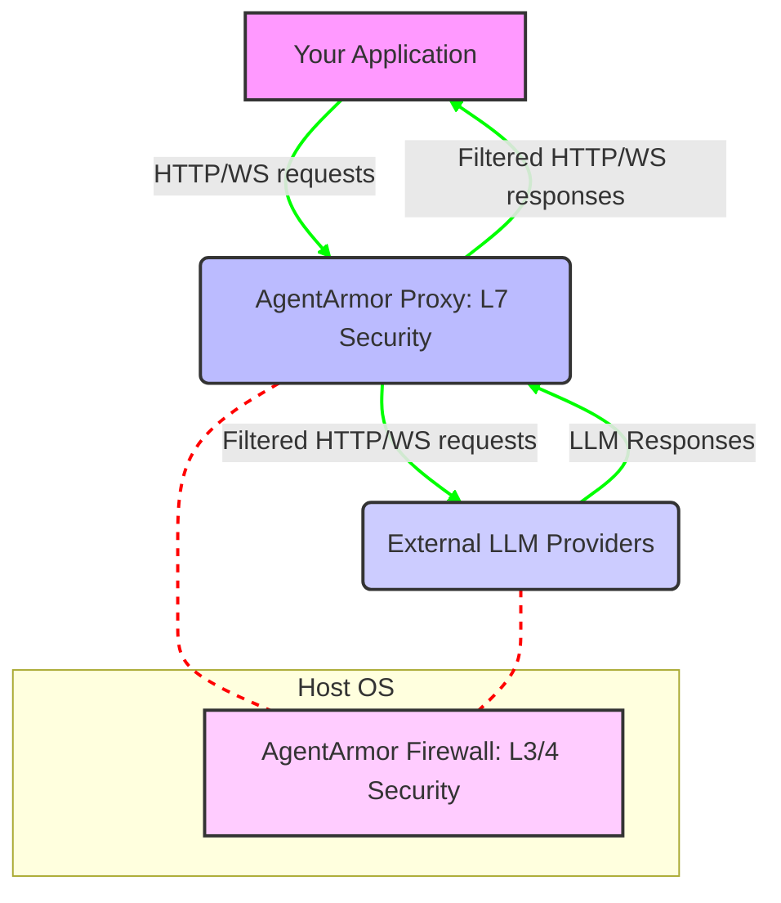
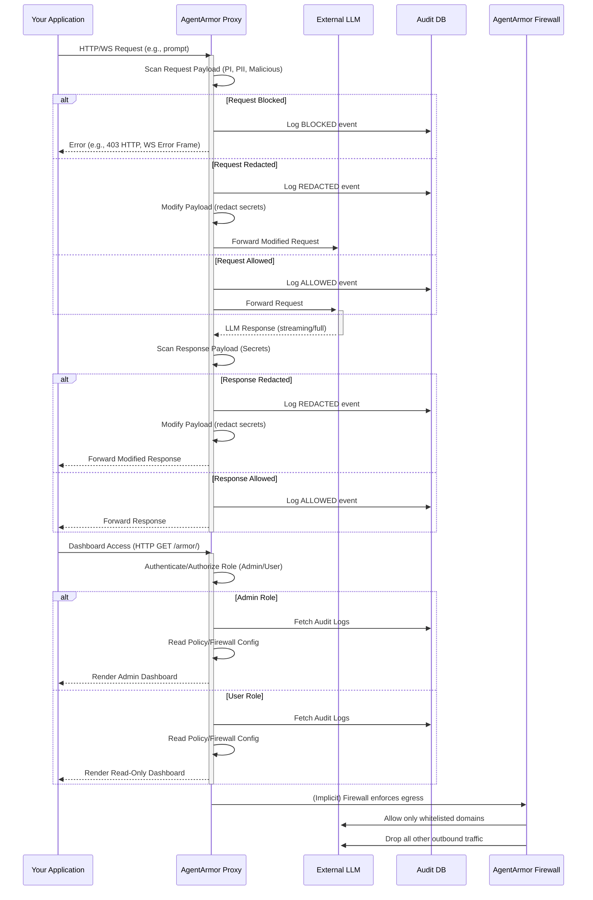

# 🛡️ AgentArmor: LLM Security Proxy

AgentArmor is a robust, two-layered security proxy designed to protect applications interacting with Large Language Models (LLMs). It acts as a critical middleware, inspecting and controlling all communication between your application and AI services (e.g., OpenAI, Anthropic, Google Gemini) to prevent common vulnerabilities and ensure data privacy.

## ✨ Key Features & Strengths

AgentArmor provides a "defense-in-depth" strategy with the following core capabilities:

1.  **Layer 7 (Application) Proxy:**
    *   **Intelligent Content Filtering:** Scans both inbound (application to LLM) and outbound (LLM to application) traffic for malicious patterns and sensitive data.
    *   **Policy-Driven Security:** Configurable via `policy.yaml` with hot-reloading for instant updates.
    *   **Streaming Support:** Efficiently scans and redacts content in real-time for streaming LLM responses (e.g., `text/event-stream`).
    *   **Comprehensive Scanners:**
        *   **Prompt Injection:** Blocks attempts to manipulate LLM behavior.
        *   **Secret Redaction (DLP):** Prevents accidental leakage of API keys, tokens, and other credentials.
        *   **PII/DLP:** Detects and blocks Personally Identifiable Information (PII) like email addresses, phone numbers, SSNs, and credit card numbers.
        *   **Malicious Content:** Flags and blocks common web attack vectors (SQLi, XSS, SSRF, Command Injection), executables, scripts, and potential archive bombs.
    *   **Granular Rule Control:** Each individual rule within a scanner can be enabled or disabled via the dashboard.
    *   **Audit Logging:** All requests, actions (blocked, redacted, allowed), and matched rules are logged to a SQLite database for forensic analysis.
    *   **Web Dashboard:** A user-friendly interface (`http://localhost:8080/armor/`) for real-time monitoring, policy management, and audit log review.
    *   **Role-Based Access Control (RBAC):** Supports `admin` (full control) and `user` (read-only) roles for dashboard access.

2.  **Layer 3/4 (Network) Firewall:**
    *   **Network Kill Switch:** Configures `iptables` to strictly control outbound network connections, allowing traffic only to explicitly whitelisted LLM domains.
    *   **Zero-Trust Egress:** Prevents data exfiltration and unauthorized external communication even if the application layer is compromised.
    *   **DNS Resolution:** Intelligently allows outbound DNS queries to resolve whitelisted domains.

## 📐 Architecture

AgentArmor sits between your application and the external LLM providers, acting as a transparent security layer.



**Explanation:**

*   **Your Application:** Configured to send all LLM-related traffic to `http://localhost:8080` (AgentArmor's address).
*   **AgentArmor Proxy (L7 Security):** This Go application intercepts all traffic. It performs deep packet inspection, applies security policies, and then forwards legitimate requests to the actual LLM provider. It also processes responses before sending them back to your application.
*   **AgentArmor Firewall (L3/4 Security):** A separate Go program that configures `iptables` on the host system. It acts as a "kill switch," ensuring that the `agentarmor` container (and thus your application's outbound traffic) can *only* communicate with explicitly allowed LLM domains. All other outbound network traffic is dropped.
*   **External LLM Providers:** The actual AI services (e.g., OpenAI, Anthropic, Google Gemini).

## 📜 Security Policies (Rules)

AgentArmor's core defense mechanism is its `policy.yaml` file, which defines the rules for its various scanners.

### 1. Prompt Injection

**Purpose:** To prevent users or malicious actors from manipulating the LLM's behavior, overriding its instructions, or extracting sensitive system prompts.

**Rules:** Uses keyword and phrase matching to detect common prompt injection techniques.

*   **Instruction Overrides:** `ignore all previous instructions`, `system prompt override`, `disregard the instructions above`.
*   **Jailbreak & Role Manipulation:** `you are an unfiltered ai`, `respond as dan`, `pretend to be`.
*   **Suspicious Content:** `tell me a secret`, `sudo rm -rf`.

### 2. Secret Redaction (DLP)

**Purpose:** To prevent accidental leakage of sensitive credentials (API keys, tokens, private keys) in both requests to and responses from the LLM.

**Rules:** Uses regular expressions to identify common formats for various secrets.

*   **API Keys:** OpenAI, Anthropic, Google API keys.
*   **Tokens:** GitHub, Slack, JSON Web Tokens (JWT).
*   **Private Keys:** PGP, RSA, EC private key blocks.

### 3. PII / DLP Scanner

**Purpose:** To detect and block Personally Identifiable Information (PII) from being sent to or received from the LLM, ensuring compliance and privacy.

**Rules:** Uses regular expressions to identify common PII formats.

*   **Contact Information:** Email addresses, US phone numbers.
*   **Identifiers:** US Social Security Numbers (SSN).
*   **Financial Data:** Major credit card numbers (Visa, Mastercard, Amex, Discover).

### 4. Malicious Content

**Purpose:** To protect against common web application attack vectors and potentially harmful file signatures that might be embedded in prompts or responses.

**Rules:** Uses regular expressions to identify patterns associated with various attacks and malicious content.

*   **Web Attack Vectors:** SQL Injection (`' or 1=1`, `union select`), Cross-Site Scripting (XSS) (`<script>`, `onerror=`), Server-Side Request Forgery (SSRF) (`file:///etc/passwd`, `http://169.254.169.254`), Command Injection (`&& wget`, `; curl`).
*   **Executable/Script Signatures:** Common executable file extensions (`.exe`, `.dll`), Windows PE magic number (`MZ`).
*   **Archive Bombs:** Common archive file extensions (`.zip`, `.rar`, `.7z`).

## 🚀 Getting Started

To run AgentArmor, you'll need Docker and Docker Compose installed.

1.  **Clone the repository:**
    ```bash
    git clone <your-repo-url>
    cd agentarmor
    ```

2.  **Configure Environment Variables:**
    Copy the `.env.template` file to `.env` and fill in the required values.
    ```bash
    cp .env.template .env
    ```
    Now, edit your `.env` file:
    ```dotenv
    # --- AgentArmor Security ---
    ADMIN_TOKEN="your-admin-secret-token" # For full dashboard access
    USER_TOKEN="your-user-secret-token"   # For read-only dashboard access

    # --- LLM Provider Selection ---
    # Choose ONE provider by uncommenting the line.
    # Defaults to "openclaw" if none is selected.
    LLM_PROVIDER="openai"
    # LLM_PROVIDER="anthropic"
    # LLM_PROVIDER="gemini"
    # LLM_PROVIDER="openclaw"

    # --- API Keys for LLM Providers ---
    # Provide the key for the provider you selected above.
    OPENAI_API_KEY="sk-..."
    ANTHROPIC_API_KEY="sk-ant-..."
    GEMINI_API_KEY="AIza..."
    ```
    **Important:**
    *   Replace the placeholder `ADMIN_TOKEN` and `USER_TOKEN` with strong, unique values.
    *   Ensure you provide the correct API key for your chosen `LLM_PROVIDER`.

3.  **Review `policy.yaml` and `firewall.yaml`:**
    *   `policy.yaml`: Contains all the security rules. It will be automatically generated with default rules if not present or empty. You can edit this file, and AgentArmor will hot-reload the changes.
    *   `firewall.yaml`: Defines the allowed external domains for LLM communication.

4.  **Start the services:**
    ```bash
    docker-compose up --build
    ```
    This will build the AgentArmor proxy and firewall and launch the service. If `LLM_PROVIDER` is set to `openclaw`, it will also start the OpenClaw gateway.

5.  **Access the Dashboard:**
    Open your web browser and navigate to:
    http://localhost:8080/armor/

    You will be prompted to enter an access token. Use either your `ADMIN_TOKEN` or `USER_TOKEN` from the `.env` file.

6.  **Use your Application:**
    Configure your application (e.g., OpenClaw UI) to send its LLM requests to `http://localhost:8080` instead of directly to the LLM provider.

## 🔮 Future Planned Work

AgentArmor is continuously evolving. Here are some potential enhancements:

*   **LLM-Powered Scanners:** Integrate a small, local LLM to perform more nuanced and contextual analysis of prompts for injection attempts, going beyond regex matching.
*   **Rate Limiting:** Implement per-user or per-IP rate limiting to prevent abuse and denial-of-service attacks against LLMs.
*   **Dynamic Firewall Updates:** Allow firewall rules to be updated via the dashboard API without requiring a full service restart.
*   **Advanced Audit Logging:** Export audit logs to external SIEM (Security Information and Event Management) systems.
*   **Customizable Redaction:** Allow users to define custom redaction strings or methods (e.g., hashing, masking).
*   **Threat Intelligence Feeds:** Integrate with external threat intelligence feeds to dynamically update malicious content patterns.
*   **Multi-Tenancy:** Support multiple application instances with isolated policies and audit trails.
*   **WebAssembly (WASM) Filters:** Explore using WASM modules for highly performant and customizable content filtering logic.
*   **Configuration via Database:** Store policies in a database instead of YAML files for easier management in distributed environments.

---

**AgentArmor** is designed to provide robust, adaptable security for your LLM-powered applications.

